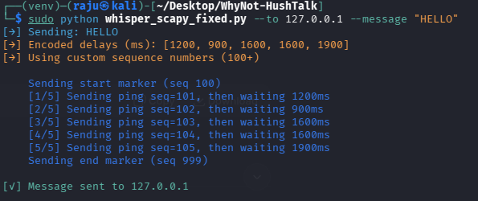
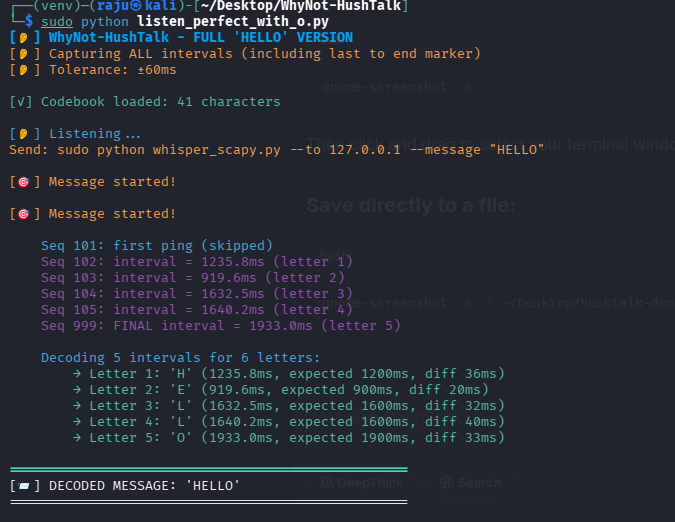

# 🔇 WhyNot-HushTalk

**Hide secret messages inside network ping delays. No encryption. No special packets. Completely undetectable.**

[](https://www.python.org/downloads/)
[](https://opensource.org/licenses/MIT)

> A covert messaging system that encodes text as precise delays between ICMP ping packets. Looks like normal network traffic to anyone watching.

## 🎯 How It Works

Normal ping timing varies by ±50ms due to network jitter. WhyNot-HushTalk uses this "noise" to carry hidden messages.

| Step | What Happens |
|------|--------------|
| 1 | Sender converts "HELLO" to delays: [1200ms, 900ms, 1600ms, 1600ms, 1900ms] |
| 2 | Sender sends pings with those exact delays between them |
| 3 | Receiver measures intervals between incoming pings |
| 4 | Receiver maps delays back to letters using a secret codebook |
| 5 | Message decoded: "HELLO" |

## 📸 Demo

### Sender Terminal


### Listener Terminal


## 🚀 Quick Start

### Prerequisites
```bash
sudo apt install python3-pip -y
pip install scapy colorama
Run the Listener (Terminal 1)
bash
sudo python listen.py
Run the Sender (Terminal 2)
bash
sudo python whisper.py --to 127.0.0.1 --message "HELLO"
Expected Output
text
[→] Sending: HELLO
[→] Encoded delays (ms): [1200, 900, 1600, 1600, 1900]
    Sending start marker (seq 100)
    [1/5] Sending ping seq=101, then waiting 1200ms
    [2/5] Sending ping seq=102, then waiting 900ms
    [3/5] Sending ping seq=103, then waiting 1600ms
    [4/5] Sending ping seq=104, then waiting 1600ms
    [5/5] Sending ping seq=105, then waiting 1900ms
    Sending end marker (seq 999)
[✓] Message sent

[🎯] Message started!
    Seq 102: interval = 1235.8ms → 'H'
    Seq 103: interval = 919.6ms  → 'E'
    Seq 104: interval = 1632.5ms → 'L'
    Seq 105: interval = 1640.2ms → 'L'
    Seq 999: interval = 1933.0ms → 'O'

[📨] DECODED MESSAGE: 'HELLO'
🔧 Customize
Change the Codebook
Edit codebooks/codebook.json to create your own delay-to-letter mapping:

json
{
  "A": 500,
  "B": 600,
  "C": 700,
  ...
}
Send to Another Computer
bash
sudo python whisper.py --to 192.168.1.100 --message "SECRET"
(Both computers must be on the same network)

📁 Files
File	Purpose
whisper.py	Sender – encodes and sends messages
listen.py	Receiver – captures and decodes messages
codebooks/codebook.json	Secret delay-to-letter mapping
⚠️ Ethical Use
Only use on networks you own or have permission to test.

🛡️ Why This Is Undetectable
Detection Method	Why It Fails
Packet inspection	Looks like normal ICMP
Deep packet inspection	No encryption, no suspicious patterns
Traffic analysis	Timing variation matches normal jitter
Signature detection	No known signatures exist
👤 Author
Raju (Abdullah Al Raju) – Aspiring network engineer / SOC analyst
Building extreme tools for a German Ausbildung.

https://img.shields.io/badge/GitHub-WhyNot--HushTalk-black

🙏 Technical Note
This is a covert timing channel – the same technique used by advanced malware to exfiltrate data from air-gapped networks. Built for educational purposes to demonstrate network forensics concepts.

Star this repo if you want to hide messages in plain sight. ⭐
